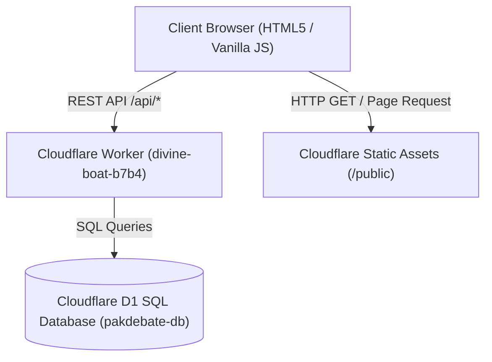

# Pak Debate Forum (PDF) — System Architecture & Handoff Report

> **Live Production Domain**: [https://pakdebateforum.com](https://pakdebateforum.com)  
> **Cloudflare Worker Endpoint**: `https://pakdebateforumn-worker.muzair9d.workers.dev`  
> **GitHub Repository**: `uzair187C/pakdebateforum`  
> **Last Updated**: August 2026  

---

## 1. Executive Summary

Pak Debate Forum (PDF) is an authoritative, international-facing debate platform and academy. The platform serves debaters, adjudicators, and academic institutions worldwide. It hosts structured training pathways, international tournament management, competitive records, and resource distribution.

This document provides a complete technical and structural handoff for future AI agents, developers, and maintainers.

---

## 2. Infrastructure & Technical Stack



| Layer | Technology | Details |
| :--- | :--- | :--- |
| **Hosting & Edge** | Cloudflare Workers & Static Assets | Global low-latency CDN serving static HTML/CSS/JS and edge runtime logic. |
| **Database** | Cloudflare D1 (SQL) | Database instance named `pakdebate-db` storing registrations, events, programs, resources, coaches, and feedback. |
| **Frontend Core** | Vanilla HTML5 & JavaScript (ES6+) | Framework-free architecture for maximum speed, accessibility, and minimal bundle overhead. |
| **Styling & Design Token System** | Modular Vanilla CSS | Token-driven architecture (`tokens.css`, `base.css`, `components.css`, `page.css`, `animations.css`). |
| **Typography** | Google Fonts | `Cormorant Garamond` (Display / Headers) + `Manrope` (Body / UI). |

---

## 3. Database Schema (`pakdebate-db`)

The platform relies on Cloudflare D1 with the following principal tables:

### 3.1. `events`
Stores competitive tournaments, workshops, and international opens.
- `id` (INTEGER PRIMARY KEY)
- `title` (TEXT), `slug` (TEXT UNIQUE)
- `category` (TEXT - e.g., 'international', 'national', 'workshop')
- `date_start` (TEXT), `date_end` (TEXT)
- `venue` (TEXT), `city` (TEXT)
- `description` (TEXT), `fee` (INTEGER)
- `registration_deadline` (TEXT), `max_participants` (INTEGER)
- `status` (TEXT - 'upcoming', 'open', 'completed')

### 3.2. `programs`
Stores Academy training courses and workshops.
- `id` (INTEGER PRIMARY KEY)
- `title` (TEXT), `slug` (TEXT UNIQUE)
- `category` (TEXT - e.g., 'debate', 'public_speaking', 'writing')
- `level` (TEXT - e.g., 'beginner', 'intermediate', 'advanced')
- `duration` (TEXT), `price` (INTEGER), `schedule` (TEXT)
- `description` (TEXT), `status` (TEXT - 'archived', 'active')

### 3.3. `registrations`
Stores student applications for programs and signups for events.
- `id` (INTEGER PRIMARY KEY)
- `type` (TEXT - 'program' | 'event')
- `reference_id` (INTEGER - foreign key to program/event)
- `full_name` (TEXT), `email` (TEXT), `phone` (TEXT), `age` (INTEGER)
- `institution` (TEXT), `experience_level` (TEXT), `notes` (TEXT)
- `created_at` (TIMESTAMP)

### 3.4. `resources`
Curated knowledge library (handbooks, motion packs, adjudication guides).
- `id` (INTEGER PRIMARY KEY), `title` (TEXT), `category` (TEXT), `url` (TEXT), `description` (TEXT)

### 3.5. `feedback`
User and participant feedback entries.
- `id` (INTEGER PRIMARY KEY), `name` (TEXT), `email` (TEXT), `category` (TEXT), `message` (TEXT), `created_at` (TIMESTAMP)

---

## 4. Frontend Architecture & Page Structure

All pages are located under the `/public` directory:

| Page Path | Purpose & Content Specification |
| :--- | :--- |
| `index.html` | **Homepage**: Hero ("Compete. Train. Connect."), verified scale stats (37 nations, 60 teams, $2,200 waivers), founding quote, case studies, 4 pathways, institutional network grid. |
| `about.html` | **About PDF**: Institutional history ("Built for Access. Proven on the World Stage."), 3 access mechanism cards, case studies (Krabi, WUDC Sofia $1,200, FLTRP $700), tournament ecosystem mapping. |
| `academy.html` | **Academy**: Training trajectory timeline (2024–2026), 5-stage learning pathway (Foundations to International Readiness), institutional workshop records (UoL, UCP, CMH). |
| `results.html` | **Competitive Record**: Verified honours only (WSDC 2026 Nairobi, Oxford WSDC 2025, WUDC Sofia 2025, Pre-WSDC 37-nation metrics). |
| `events.html` | **Events Ecosystem**: Filterable index of upcoming and completed tournaments and community workshops. |
| `programs.html` | **Programme Directory**: Filterable directory of Academy courses open to global participants. |
| `resources.html` | **Knowledge Library**: Curated motion packs, adjudication guides, format handbooks, and video archives. |
| `contact.html` | **Contact & Inquiry**: International-welcoming contact form and direct communication channels. |
| `register.html` | **Registration & Application**: Dynamic signup form with strict numeric input enforcement for phone and age. |
| `feedback.html` | **Feedback Submission**: User feedback form submitting directly to Cloudflare D1. |
| `admin.html` | **Admin Dashboard**: Password-protected management UI for events, programs, registrations, and resources. |

---

## 5. Strict Data Integrity & Content Rules

> [!IMPORTANT]
> **NO FABRICATION OF DATA**  
> All statistics, tournament names, student achievements, and grant amounts on the platform MUST be grounded in documented PDF organizational history. Never add fake student names, invented trophies, or generic placeholder numbers.

### Core Verified Metrics Benchmark:
- **37 Nations** represented at the Pakistan Pre-WSDC
- **60 International & National Teams** hosted
- **$2,200 Total Equity & Financial Waivers** disbursed across tournaments
- **$1,200 WUDC Sofia Scholarship** awarded to PDF team
- **$700 FLTRP Community Support** grant
- **WSDC 2026 Nairobi** National Team Selection

---

## 6. Form Input Validation & Sanitization

All input fields across forms have been hardened against invalid data entry:
- **Phone Fields (`#phone`, `input[type="tel"]`)**: Restricted to digits, `+`, spaces, hyphens, and parentheses via `inputmode="tel"` and `main.js` input sanitizers.
- **Age / Numeric Fields (`#age`, `input[type="number"]`)**: Strictly restricted to non-negative integer digits. Typing non-numeric characters is intercepted on `keydown` and filtered on `input`.

---

## 7. Deployment & Maintenance Workflows

### 7.1. Local Development
```bash
cd divine-boat-b7b4
npx wrangler dev
```

### 7.2. Production Deployment
To deploy static assets and worker code to Cloudflare:
```bash
cd divine-boat-b7b4
npm run deploy
```
*Or directly via Wrangler:*
```bash
npx wrangler deploy
```

### 7.3. Database Migrations / Schema Execution
```bash
npx wrangler d1 execute pakdebate-db --file=./schema.sql
```

---

## 8. Summary for Future Agents

When modifying this repository:
1. **Preserve Design System**: Always use CSS variables from `tokens.css` (e.g., `var(--color-accent-gold)`, `var(--font-display)`, `var(--sp-4)`). Do not add inline styles or plain hex values unless necessary.
2. **Founding Quote Style**: Keep `.founding-quote` styled with standard serif font, proper line-height, gold border, and decorative quote mark `“`. Do not apply italic styles to large blockquotes.
3. **Keep Git Workspace Clean**: Do not remove `.gitignore` rules for build artifacts (`.wrangler/`, `node_modules/`, `.gemini/`, `.tempmediaStorage/`).
